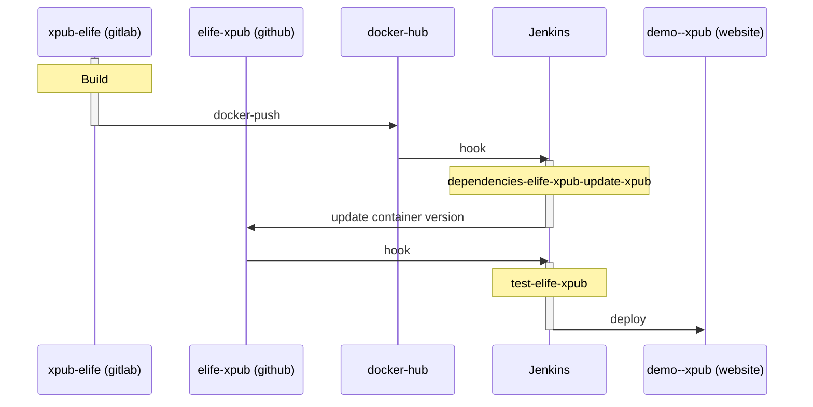

eLife xPub
=============

[](https://ci--alfred.elifesciences.org/blue/organizations/jenkins/test-elife-xpub/activity)
[](https://mattermost.coko.foundation/coko/channels/xpub)

Description
============
An eLife specific implementation of the [xPub][1] submission and peer-review system for scholarly journals. [xPub][1] is a journal publishing workflow implementation of [PubSweet][2], an open toolkit for building publishing workflows.

This is a collaboration between eLife and the Collaborative Knowledge Foundation (Coko), [more information in our press release][3].

[1]: https://gitlab.coko.foundation/xpub/xpub-elife
[2]: https://gitlab.coko.foundation/pubsweet/pubsweet-server
[3]: https://elifesciences.org/for-the-press/67d013c4/elife-and-collaborative-knowledge-foundation-partner-to-deliver-open-source-submission-and-peer-review-platform

This repo contains scripts to synchronise the selected commit of [xPub][1] so that it can be deployed to eLife's instance on AWS using [https://github.com/elifesciences/elife-xpub-formula][4]. This repo will also contain any eLife specific components or configuration.

[4]: https://github.com/elifesciences/elife-xpub-formula

Roadmap
========

Current progress and next steps are [available in the Github project][5] which will link to active issues on the relevant Github or Gitlab repos.

[5]: https://github.com/elifesciences/elife-xpub/projects/1

Contributing
============
Find us and the Coko team on the [Coko Mattermost Chat][6] for more information.

[6]: https://mattermost.coko.foundation

Local setup
===========

Run these commands:

```
docker-compose up -d postgres
docker-compose run app /bin/bash -c "npx pubsweet setupdb --username=foo --password=password --email=foo@example.com --clobber"
docker-compose up
```

Visit the web interface at [http://localhost:3000].

Build
=====

The following [sequence-diagram](https://mermaidjs.github.io/sequenceDiagram.html) shows how the building of this project is triggered from `xpub-elife` to the deployment on the [demo website](https://demo--xpub.elifesciences.org/login)


