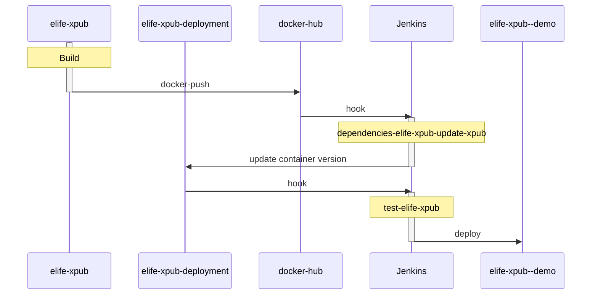

# Pipeline

> **NOTE** This page uses mermaid to show the sequence diagram.

The following [sequence-diagram](https://mermaidjs.github.io/sequenceDiagram.html) shows how the building of this project is triggered from `xpub-elife` to the deployment on the [demo website](https://demo--xpub.elifesciences.org/login)

Diagram source:

