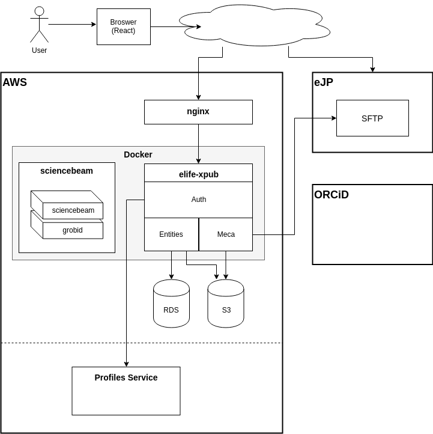

# Architecture

## System Architecture

Below is a diagram to help visualise `elife-xpub` within the wider ecosystem of services at eLife.



## Software Architecture

```
/server
 |-- client-config
 |-- dupes
 |-- meca
 |-- datamodel (xpub-model)
 |-- model (business objects / logic)
 \-- interface (xpub-server)
```
