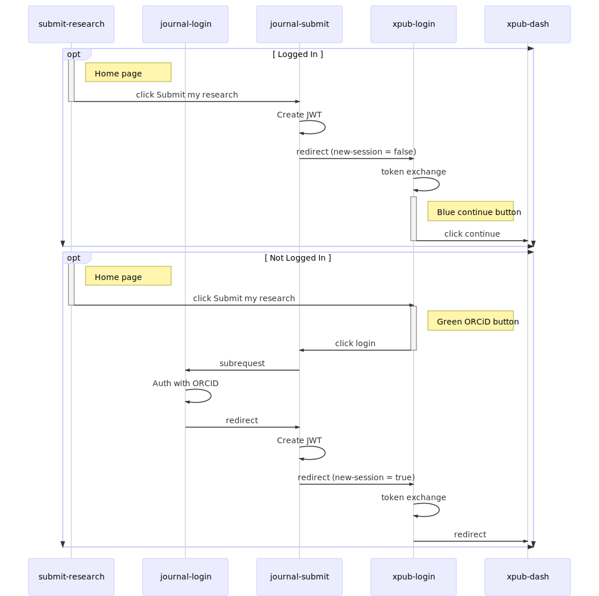

# Login

## Authentication

- The main routes are wrapped with the [AuthenticatedComponent](https://github.com/elifesciences/elife-xpub/blob/b02c24d908e7093c29ff51637546c3fd3ec043b4/app/routes.js#L45)
- The [AuthenticatedComponent](https://github.com/elifesciences/elife-xpub/blob/b02c24d908e7093c29ff51637546c3fd3ec043b4/packages/component-elife-app/client/components/AuthenticatedComponent.js#L11) will check the localstorage for the token.
  If its not there will redirect to the '/login' page.
- Getting, Setting and Exchanging the token is handled within the [LoginPage](https://github.com/elifesciences/elife-xpub/blob/develop/packages/component-login/client/pages/LoginPage.js)
- The token is exchanged (by signing) with one that lasts just 1 day in the [resolver](https://github.com/elifesciences/elife-xpub/blob/b02c24d908e7093c29ff51637546c3fd3ec043b4/packages/component-elife-app/server/resolvers.js#L15)
- There is a [mock token exchange](https://github.com/elifesciences/elife-xpub/blob/b02c24d908e7093c29ff51637546c3fd3ec043b4/packages/component-elife-app/server/routes/publicConfig.js#L19) for development

## Login Flow

[Edit here](https://mermaidjs.github.io/mermaid-live-editor/#/edit/eyJjb2RlIjoic2VxdWVuY2VEaWFncmFtXG4gICAgcGFydGljaXBhbnQgU1IgYXMgc3VibWl0LXJlc2VhcmNoXG4gICAgcGFydGljaXBhbnQgSkwgYXMgam91cm5hbC1sb2dpblxuICAgIHBhcnRpY2lwYW50IEpTIGFzIGpvdXJuYWwtc3VibWl0XG4gICAgcGFydGljaXBhbnQgWEwgYXMgeHB1Yi1sb2dpblxuICAgIHBhcnRpY2lwYW50IFhEIGFzIHhwdWItZGFzaFxuXG5vcHQgTG9nZ2VkIEluXG5BY3RpdmF0ZSBTUlxuTm90ZSByaWdodCBvZiBTUjogSG9tZSBwYWdlXG5TUiAtPj4gSlM6IGNsaWNrIFN1Ym1pdCBteSByZXNlYXJjaFxuZGVhY3RpdmF0ZSBTUlxuSlMgLT4-IEpTOiBDcmVhdGUgSldUXG5KUyAtPj4gWEw6IHJlZGlyZWN0XG5hY3RpdmF0ZSBYTFxubm90ZSByaWdodCBvZiBYTDogQmx1ZSBjb250aW51ZSBidXR0b25cblhMIC0-PiBYRDogY2xpY2sgY29udGludWVcbmRlYWN0aXZhdGUgWExcbmVuZFxuXG5vcHQgTm90IExvZ2dlZCBJblxuQWN0aXZhdGUgU1Jcbk5vdGUgcmlnaHQgb2YgU1I6IEhvbWUgcGFnZVxuU1IgLT4-IFhMOiBjbGljayBTdWJtaXQgbXkgcmVzZWFyY2hcbmRlYWN0aXZhdGUgU1JcbmFjdGl2YXRlIFhMXG5ub3RlIHJpZ2h0IG9mIFhMOiBHcmVlbiBPUkNpRCBidXR0b25cblhMIC0-PiBKUzogY2xpY2sgbG9naW5cbmRlYWN0aXZhdGUgWExcbkpTIC0-PiBKTDogc3VicmVxdWVzdFxuSkwgLT4-IEpMOiBBdXRoIHdpdGggT1JDSURcbkpMIC0-PiBKUzogcmVkaXJlY3RcbkpTIC0-PiBKUzogQ3JlYXRlIEpXVFxuSlMgLT4-IFhMOiByZWRpcmVjdFxuWEwgLT4-IFhEOiByZWRpcmVjdFxuZW5kXG4iLCJtZXJtYWlkIjp7InRoZW1lIjoiZGVmYXVsdCJ9fQ)

